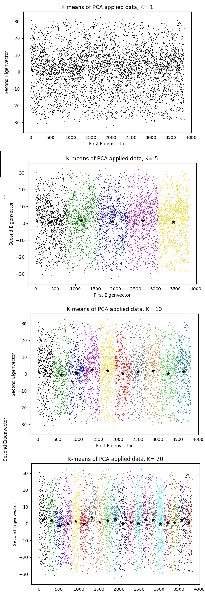
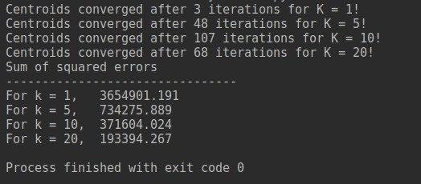

# K-means Clustering

In this project, I tried to cluster a dataset with the help of k-means algorithm. I used pseudo-code from Ethem Alpaydin’s book, "Introduction to Machine Learning". Firstly, I took the PCA code that I implemented for project-3, and found 2 eigenvectors that have the biggest two eigenvalues. I created a new dataset with these 2 eigenvectors which resemble the data very well. So, I started with the dimensionality reduction. Second step of clustering is applying k-means algorithm for K=1,5,10,20 and calculating sum of squared error. The results of my implementation are as follows:

Instead of drawing boundaries, I painted each cluster’s data points differently. So, it’s obvious to see that which data point belongs to which cluster. When we look at the graphs and the sum of squared error values, K=20 has the best result for K=1,5,10,20.